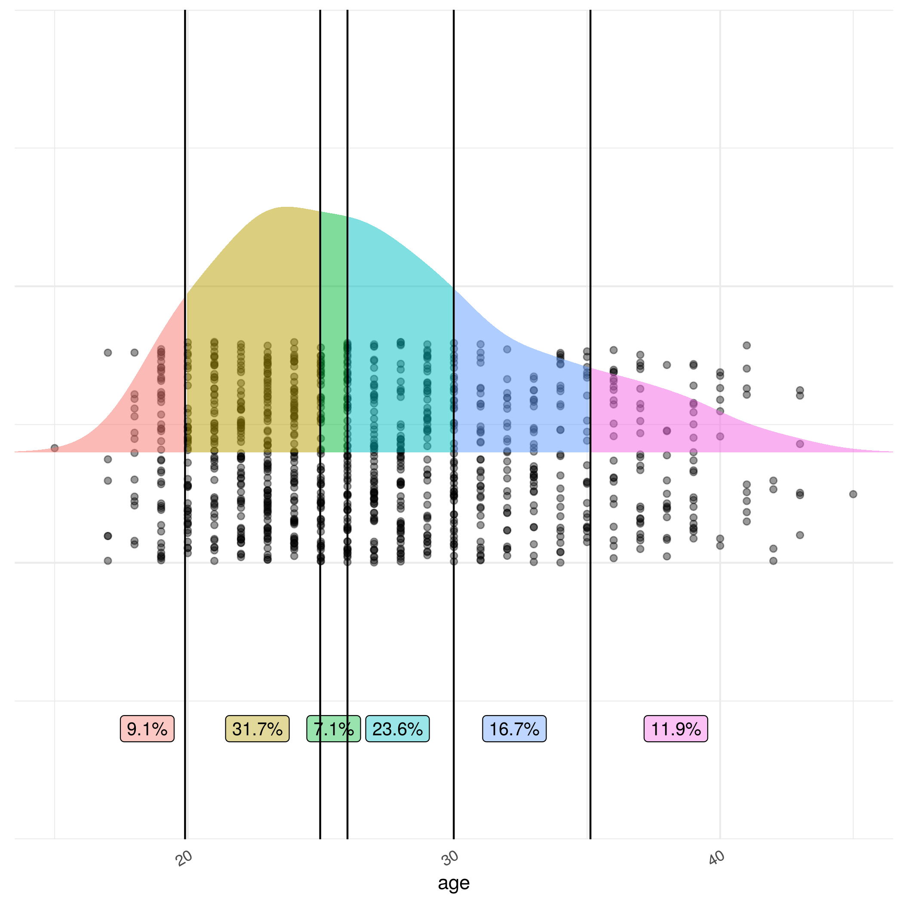
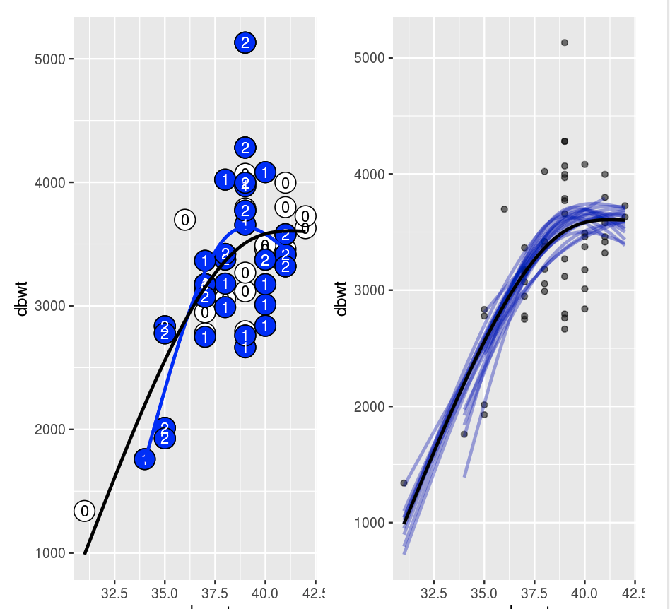

```{r, include = FALSE}
knitr::opts_chunk$set(
  collapse = TRUE,
  comment = "#>")

library(LittleApp2)
library(shiny)
app_url <- function(name) {
  paste0(
    "https://maa-statprep.shinyapps.io/Little_App_", 
    name)
}
```

```{r setup}

```

Little Apps are tools for teaching and learning statistical concepts. They are interactive web pages that display data and statistical graphics in standard web browsers. 

Each Little App is accessed through an ordinary web link (listed below) and is centered on a particular statistical methodology, technique, or graphic. Some of the Apps display techniques that will fit into just about any existing intro stats course. 

1. [Center and Spread](`r app_url("Spread")`)
2. [Points and Densities](`r app_url("Density")`)
3. [Confidence and T](`r app_url("T")`)

Others are oriented to contemporary approaches to teaching statistics.

4. [Resampling](`r app_url("Bootstrap")`)

Still others implement topics can help instructors adopt to recent calls for change such as the GAISE recommendations about multivariate thinking and the American Statistical Association's posture on p-values.

5. [Stratification and Confounding](`r app_url("Stratify")`)
6. [Regression Modeling](`r app_url("Regression")`)

Each Little App is oriented around a graphical display of data with statistical annotations. Users can select the size of sample to draw at random from a "population" of the entire dataset. *Every* App shows each point in the sample.

App | Graphic | App | Graphic
----|---------|-----|---------
[Center & Spread](`r app_url("Spread")`) |  | [Points & Densities](`r app_url("Density")`) | 
[Confidence & T](`r app_url("T")`) |  | [Resampling](`r app_url("Bootstrap")`) |  
[Stratification](`r app_url("Stratify")`) |  | [Regression](`r app_url("Regression")`) |  

